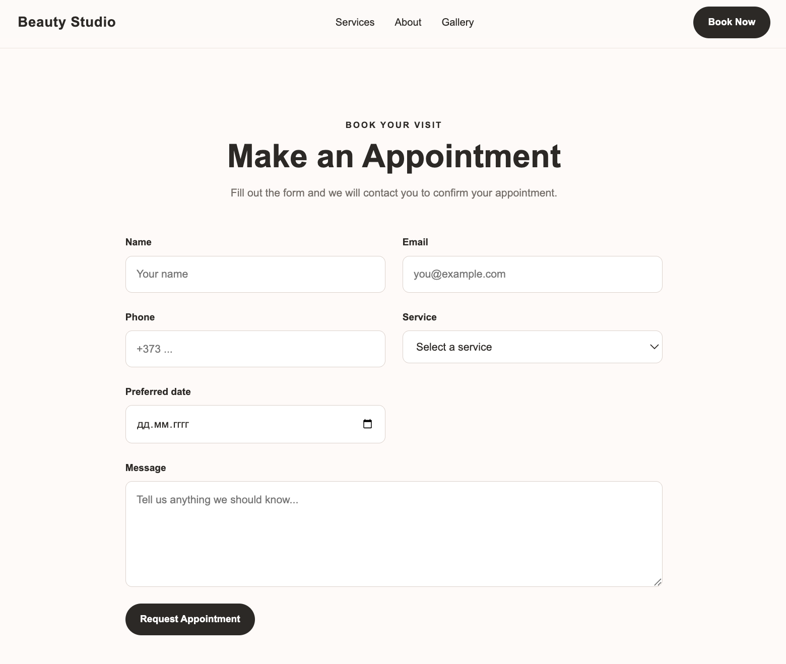

# Beauty Studio

A modern and responsive beauty studio website built with **React, TypeScript and Vite**.

The project includes a client-facing booking form and a simple admin panel for managing appointment requests. It was built as a portfolio project to practice building a realistic frontend application with form handling, asynchronous operations, local data persistence and React state management.

## 🌐 Live Demo

[View Live Demo](https://beauty-studio-vahnovan.vercel.app)

## 📸 Preview

## ✨ Features

### Client Side

* Responsive beauty studio landing page
* Hero section with call-to-action
* Services section
* About section
* Gallery
* Customer reviews
* Appointment booking form
* Form validation
* Service selection with price and duration information
* Date validation
* Loading state during form submission
* Success and error messages
* Booking data persistence using `localStorage`

### Admin Panel

* Display all appointment requests
* View client information
* View selected service and appointment date
* View optional client messages
* Booking status management:

  * Pending
  * Confirmed
  * Cancelled
* Delete bookings with confirmation
* Automatic refresh of the booking list after creating a new appointment

## 🛠️ Technologies

* **React**
* **TypeScript**
* **Vite**
* **CSS3**
* **HTML5**
* **React Hooks**
* **localStorage**
* **Async/Await**
