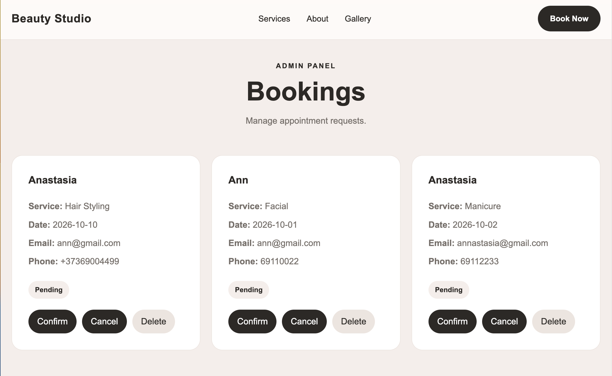
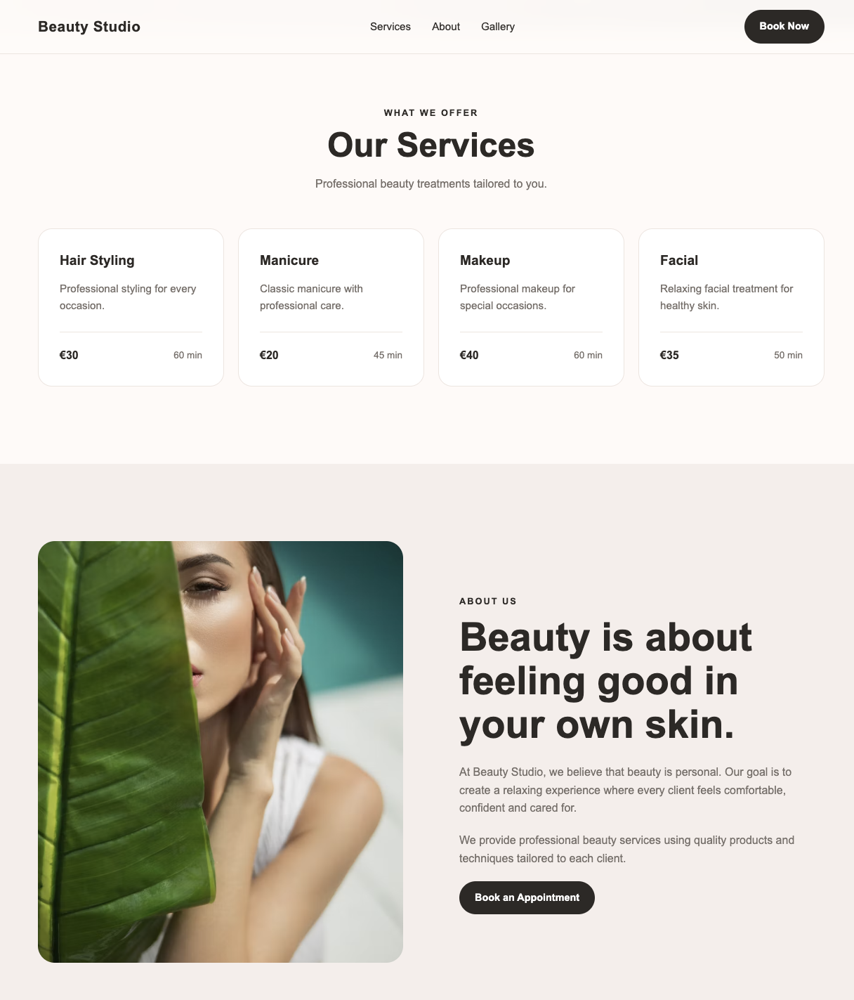

# Beauty Studio

A responsive React + TypeScript booking application for a beauty studio,
featuring appointment scheduling and an admin panel for managing bookings.

The project includes a client-facing booking form and a simple admin panel for managing appointment requests. It was built as a portfolio project to practice building a realistic frontend application with form handling, asynchronous operations, local data persistence and React state management.

## 🌐 Live Demo

[View Live Demo](https://beauty-studio-vahnovan.vercel.app)

## 📸 Preview

## ✨ Features

Client Side
Responsive beauty studio landing page
Hero section with call-to-action
Services section
About section
Gallery
Customer reviews
Appointment booking form
Form validation
Service selection with price and duration information
Date validation
Loading state during form submission
Success and error messages
Booking data persistence using localStorage
Admin Panel
View all appointment requests
View client information
View selected service and appointment date
View optional client messages
Manage booking status:
Pending
Confirmed
Cancelled
Delete bookings with confirmation
Automatic refresh of the booking list after creating a new appointment
🛠️ Tech Stack
React
TypeScript
Vite
React Hooks
HTML5
CSS3
localStorage
Async/Await
💡 What I Practiced

This project helped me practice:

Building reusable React components
Managing component state with React Hooks
Working with controlled forms
Client-side form and date validation
Handling asynchronous operations
Managing loading, success and error states
Persisting application data with localStorage
Building responsive layouts
Structuring a React + TypeScript application
Creating an admin interface for managing application data
Deploying a frontend application with Vercel
📁 Project Structure
src/
├── components/
├── pages/
├── hooks/
├── types/
├── ...
└── main.tsx
🚀 Getting Started

Clone the repository:

git clone https://github.com/nndio/beauty-studio.git

Navigate to the project:

cd beauty-studio

Install dependencies:

npm install

Start the development server:

npm run dev

Open the application in your browser at the local address provided by Vite.

📱 Responsive Design

The application is designed to provide a responsive experience across desktop and mobile screen sizes.

☁️ Deployment

The application is deployed using Vercel.

Live Demo:
https://beauty-studio-vahnovan.vercel.app/

👩‍💻 Author

Anastasia Vahnovan

Junior Frontend Developer

GitHub: https://github.com/nndio
LinkedIn: https://linkedin.com/in/anastasia-vahnovan
